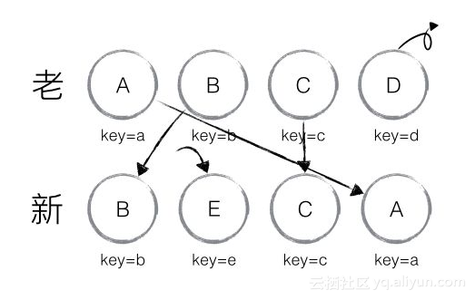

# React 虚拟dom
#### 虚拟DOM
- 虚拟DOM的简单实现（diff算法）
- 虚拟DOM的内部工作原理
- React中的虚拟DOM与Vue中的虚拟DOM比较
#### 那么虚拟DOM和DOM之间的关系是什么呢？ 
- Virtual DOM并没有完全实现DOM，即虚拟DOM和真正地DOM是不一样的
- Virtual DOM最主要的还是保留了Element之间的层次关系和一些基本属性。
- 因为真实DOM实在是太复杂，一个空的Element都复杂得能让你崩溃，并且几乎所有内容我根本不关心好吗。所以Virtual DOM里每一个Element实际上只有几个属性，即最重要的，最为有用的，并且没有那么多乱七八糟的引用，比如一些注册的属性和函数啊，这些都是默认的，创建虚拟DOM进行diff的过程中大家都一致，是不需要进行比对的。
- 哪怕是直接把Virtual DOM删了，根据新传进来的数据重新创建一个新的Virtual DOM出来都非常非常非常快。（每一个component的render函数就是在做这个事情，给新的virtual dom提供input）。
#### 虚拟dom的简单实现
- 用JS对象模拟DOM树
- 比较两棵虚拟DOM树的差异
- 把差异应用到真正的DOM树上
#### 1、用JS对象模拟DOM树
- 首先我们要明白**真实的DOM元素是非常庞大的，这是因为标准就是这么设计的，而且操作他们的时候你要小心翼翼，轻微的触碰就有可能导致页面发生重排，这是杀死性能的罪魁祸首。**
- 而相对于DOM对象，**原生的JavaScript对象**处理起来更快，而且更简单，**DOM树上的结构信息我们都可以使用JavaScript对象很容易的表示出来**。
### diff简介
> 

DIFF算法在执行时有三个维度，分别是Tree DIFF、Component DIFF和Element DIFF，执行时按顺序依次执行，它们的差异仅仅因为DIFF粒度不同、执行先后顺序不同。 
> 

**Tree DIFF**是对树的每一层进行遍历，如果某组件不存在了，则会直接销毁。如图所示，左边是旧属，右边是新属，第一层是R组件，一模一样，不会发生变化；第二层进入Component DIFF，同一类型组件继续比较下去，发现A组件没有，所以直接删掉A、B、C组件；继续第三层，重新创建A、B、C组件。
> 

从图上我么可以知道，第一层遍历完，进行第二层遍历时，D和G组件是不同类型的组件，不同类型组件直接进行替换，将D删掉，再将G重建
> 

Element DIFF紧接着以上统一类型组件继续比较下去，常见类型就是列表。同一个列表由旧变新有三种行为，插入、移动和删除，它的比较策略是对于每一个列表指定key，先将所有列表遍历一遍，确定要新增和删除的，再确定需要移动的。如图所示，第一步将D删掉，第二步增加E，再次执行时A和B只需要移动位置即可